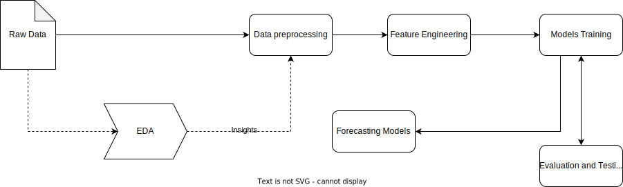

---

# Analyse des Impacts du Travail Hybride sur les Marchés Immobiliers

## Équipe JYM
- Joel Chrispin
- Yacine N'Diaye
- Mady Semega

Ce projet a été développé dans le cadre du Défi I3C organisé par Ivanhoé Cambridge. Notre équipe, JYM, a exploré les conséquences du travail hybride sur les marchés immobiliers, en se concentrant sur les villes américaines.

### Contexte
En réponse à la pandémie de COVID-19 et à la montée du travail hybride, nous avons été mandatés pour évaluer l'impact de cette nouvelle réalité sur les marchés immobiliers. Notre objectif était d'identifier des opportunités d'investissement pour le portefeuille immobilier d'Ivanhoé Cambridge, en tenant compte des transformations dues au travail hybride.

### Objectif
L'objectif principal de ce projet était de fournir des recommandations basées sur une analyse quantitative des différentes classes d'actifs immobiliers. Nous avons concentré nos efforts sur l'analyse des bureaux, des centres commerciaux, des actifs industriels, et des propriétés résidentielles dans diverses villes américaines.

### Méthodologie
Notre analyse s'appuie sur des réseaux neuronaux temporels pour prédire des métriques clés telles que la valeur des actifs, le taux d'occupation des propriétés, le classement de désirabilité des villes et le pourcentage d'emplois à distance. La période de prévision s'étendait d'octobre 2023 à fin décembre 2025.

## Structure du Répertoire

```
repo/
│
├── data/
│   ├── raw/                  # Données CSV brutes
│   ├── processed/            # Données nettoyées et formatées
│
├── notebooks/
│   ├── EDA/                  # Carnets Jupyter pour l'analyse exploratoire des données
│   └── feature_exploration/  # Carnets explorant les caractéristiques élaborées
│
├── src/
│   ├── preprocessing/        # Scripts pour le nettoyage et le formatage des données
│   ├── post_processing/      # Scripts pour le traitement des données predites 
│   ├── modeling/             # Scripts de développement et de formation des modèles
├── README.md                 # Vue d'ensemble, instructions de configuration et guide d'utilisation
```

## Diagramme du système



### Légende

- **Flèches pleines** : Indiquent le flux principal des données ou des processus d'une étape à l'autre.
- **Flèches en pointillés** : Représentent le flux d'aperçus ou de retours d'informations qui informent d'autres étapes mais ne transportent pas de données pour le traitement.
- **Blocs rectangulaires** : Désignent des étapes ou des modules de traitement actifs où les données sont manipulées ou les modèles développés.
- **Blocs en Forme de diamant** : Signifient des processus de prise de décision ou de sélection qui influencent la direction du flux de travail.

### Annotations

1. **Données brutes** : Le point de départ contenant des données non traitées collectées au fil du temps, structurées au format CSV.

2. **EDA (Analyse exploratoire des données)** : Une étape préliminaire pour explorer et comprendre les caractéristiques des données, détecter les anomalies et découvrir des modèles qui guideront le traitement ultérieur des données et l'ingénierie des caractéristiques.

3. **Prétraitement des données** : Nettoyage, normalisation et transformation des données brutes en un format adapté à l'analyse et à la modélisation.

4. **Ingénierie des caractéristiques** : Processus de création de nouvelles caractéristiques à partir des données existantes pour améliorer la performance des modèles.

5. **Formation des modèles** : Développement et formation de modèles prédictifs utilisant les caractéristiques élaborées.

6. **Modèles de prévision** : Sélection des modèles les plus performants dédiés à la prévision de points de données futurs.

7. **Optimisation des hyperparamètres et sélection des modèles de prévision** : Réglage itératif des paramètres du modèle pour améliorer la performance et sélection des modèles de prévision les plus précis.

8. **Évaluation et tests** : Évaluation de la performance des modèles à l'aide de métriques telles que la précision, la sensibilité, le rappel, etc., pour garantir qu'ils répondent aux normes prédictives souhaitées.


## Utilisation

Pour explorer notre analyse et nos recommandations, veuillez consulter le notebook `analysis_and_recommendations.ipynb` et les notebooks identifie sur les workspaces des membres de l'equipe en annexe du rapport. Assurez-vous d'avoir le fichier `all_data.csv` et le notebook dans le meme dossier pour executer le notebook. 

## Infrastructure de l'entrainement

```
+---------------------------------------------------------------------------------------+
| NVIDIA-SMI 535.129.03             Driver Version: 535.129.03   CUDA Version: 12.2     |
|-----------------------------------------+----------------------+----------------------+
| GPU  Name                 Persistence-M | Bus-Id        Disp.A | Volatile Uncorr. ECC |
| Fan  Temp   Perf          Pwr:Usage/Cap |         Memory-Usage | GPU-Util  Compute M. |
|                                         |                      |               MIG M. |
|=========================================+======================+======================|
|   0  NVIDIA H100 80GB HBM3          On  | 00000000:61:00.0 Off |                    0 |
| N/A   25C    P0              70W / 700W |      4MiB / 81559MiB |      0%      Default |
|                                         |                      |             Disabled |
+-----------------------------------------+----------------------+----------------------+
|   1  NVIDIA H100 80GB HBM3          On  | 00000000:62:00.0 Off |                    0 |
| N/A   28C    P0              72W / 700W |      4MiB / 81559MiB |      0%      Default |
|                                         |                      |             Disabled |
+-----------------------------------------+----------------------+----------------------+
|   2  NVIDIA H100 80GB HBM3          On  | 00000000:63:00.0 Off |                    0 |
| N/A   28C    P0              72W / 700W |      4MiB / 81559MiB |      0%      Default |
|                                         |                      |             Disabled |
+-----------------------------------------+----------------------+----------------------+
|   3  NVIDIA H100 80GB HBM3          On  | 00000000:64:00.0 Off |                    0 |
| N/A   29C    P0              71W / 700W |      4MiB / 81559MiB |      0%      Default |
|                                         |                      |             Disabled |
+-----------------------------------------+----------------------+----------------------+
|   4  NVIDIA H100 80GB HBM3          On  | 00000000:6A:00.0 Off |                    0 |
| N/A   25C    P0              68W / 700W |      4MiB / 81559MiB |      0%      Default |
|                                         |                      |             Disabled |
+-----------------------------------------+----------------------+----------------------+
|   5  NVIDIA H100 80GB HBM3          On  | 00000000:6B:00.0 Off |                    0 |
| N/A   29C    P0              69W / 700W |      4MiB / 81559MiB |      0%      Default |
|                                         |                      |             Disabled |
+-----------------------------------------+----------------------+----------------------+
|   6  NVIDIA H100 80GB HBM3          On  | 00000000:6C:00.0 Off |                    0 |
| N/A   29C    P0              71W / 700W |      4MiB / 81559MiB |      0%      Default |
|                                         |                      |             Disabled |
+-----------------------------------------+----------------------+----------------------+
|   7  NVIDIA H100 80GB HBM3          On  | 00000000:6D:00.0 Off |                    0 |
| N/A   26C    P0              70W / 700W |      4MiB / 81559MiB |      0%      Default |
|                                         |                      |             Disabled |
+-----------------------------------------+----------------------+----------------------+
```